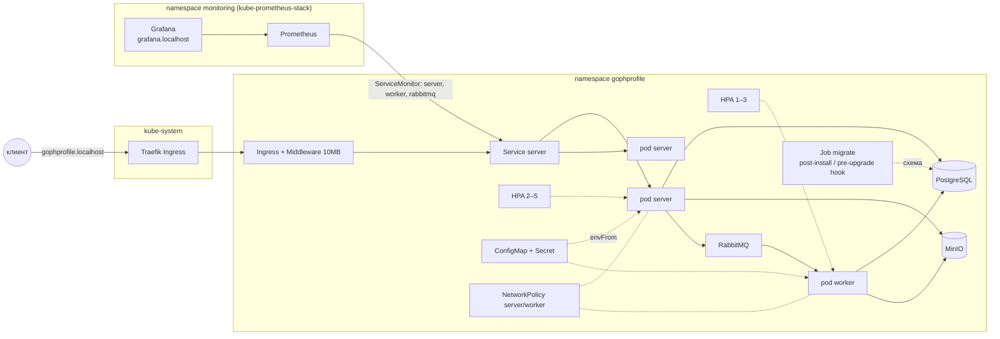

# GophProfile

Сервис аватарок: REST API для загрузки картинок, асинхронное создание миниатюр и веб-интерфейс. Учебный проект Яндекс.Практикума.

## Архитектура

```
клиент ──HTTP──> server ──┬── PostgreSQL   метаданные (таблица avatars)
                          ├── MinIO (S3)   оригиналы и миниатюры
                          └── RabbitMQ ──> worker ──> MinIO + PostgreSQL
```

- **server** (`cmd/server`) — REST API и веб-интерфейс. Принимает файл, кладёт оригинал в S3, метаданные в PostgreSQL и публикует событие в RabbitMQ. Файлы отдаёт проксированием из S3 — наружу торчит только HTTP API.
- **worker** (`cmd/worker`) — консюмер событий. Строит миниатюры 100x100 и 300x300 (всегда JPEG), удаляет объекты из S3 после удаления аватарки.
- **Надёжность** — ретраи с экспоненциальным backoff (1s/4s/16s) внутри консюмера, после исчерпания сообщение уходит в dead-letter очередь `avatar.dead`, а аватарка помечается `failed`. Обработка идемпотентна: повторная доставка события ничего не ломает.
- Удаление — мягкое: строка помечается `deleted_at`, объекты из S3 подчищает worker асинхронно.

## Быстрый старт

Всё в контейнерах:

```bash
docker compose --profile app up -d --build
```

Веб-интерфейс: <http://localhost:8080/web/upload>, галерея: `http://localhost:8080/web/gallery/{user_id}`.

Для локальной разработки — только инфраструктура, сервер и worker нативно:

```bash
docker compose up -d          # postgres, minio, rabbitmq + мониторинг-стек
cp .env.example .env
make run                      # сервер
make run-worker               # worker (в другом терминале)
```

Третий вариант — Kubernetes-кластер: см. раздел [«Развёртывание в Kubernetes»](#развёртывание-в-kubernetes).

## API

Аутентификации нет: пользователя идентифицирует заголовок `X-User-ID` (обязателен для загрузки и удаления). Чтение — публичное.

Swagger UI с актуальной спецификацией: `GET /swagger/index.html` (генерируется из аннотаций хендлеров командой `make swagger`, исходники — `docs/`).

| Метод и путь | Описание |
|---|---|
| `POST /api/v1/avatars` | Загрузка (multipart-поле `file` или `image`, до 10MB). 201 → `{id, user_id, url, status, created_at}`; 400 без заголовка/файла; 413 при превышении размера |
| `GET /api/v1/avatars/{id}` | Оригинал (бинарно, с Content-Type) |
| `GET /api/v1/avatars/{id}/thumbnails/{size}` | Миниатюра `100x100` или `300x300`; 404, пока обработка не завершена |
| `GET /api/v1/avatars/{id}/metadata` | Метаданные: размеры, миниатюры, статус обработки |
| `DELETE /api/v1/avatars/{id}` | Удаление; 403 — чужая аватарка; 204 — успех |
| `GET /api/v1/users/{uid}/avatar` | Последняя аватарка пользователя |
| `DELETE /api/v1/users/{uid}/avatar` | Удаление последней (только своей) |
| `GET /api/v1/users/{uid}/avatars` | Список аватарок пользователя |
| `GET /health` | Статусы компонентов: db, s3, broker; 503 при деградации (readiness-проба в K8s) |
| `GET /live` | Всегда 200, без проверки зависимостей (liveness-проба в K8s) |
| `GET /swagger/*` | Swagger UI и спецификация OpenAPI |
| `GET /` , `GET /web/upload` | Форма загрузки |
| `GET /web/gallery/{uid}` | Галерея пользователя |

Статусы обработки в метаданных: `pending` → `processing` → `completed`, либо `failed` (например, файл не является картинкой), либо `deleted`.

## Конфигурация

Переменные окружения (флаги командной строки переопределяют, см. `-h`):

| Переменная | Назначение | Дефолт |
|---|---|---|
| `RUN_ADDRESS` | адрес HTTP-сервера | `:8080` |
| `DATABASE_DSN` | строка подключения PostgreSQL | — (обязательна) |
| `S3_ENDPOINT` | S3 endpoint (host:port) | — (обязательна) |
| `S3_ACCESS_KEY` / `S3_SECRET_KEY` | ключи S3 | — (обязательны) |
| `S3_BUCKET` | бакет | `avatars` |
| `S3_USE_SSL` | https к S3 | `false` |
| `RABBITMQ_URL` | строка подключения AMQP | — (обязательна) |
| `WORKER_PREFETCH` | лимит неподтверждённых сообщений worker'а | `8` |
| `LOG_LEVEL` | уровень логов | `info` |
| `OTEL_EXPORTER_OTLP_ENDPOINT` | OTLP gRPC endpoint для трейсов; пустое значение выключает трейсинг | `localhost:4317` |
| `METRICS_ADDRESS` | адрес `/metrics` worker'а (сервер отдаёт `/metrics` на `RUN_ADDRESS`) | `:9091` |
| `DATABASE_AUTO_MIGRATE` | применять миграции при старте сервера; в K8s выключено — схемой владеет Helm-хук | `true` |
| `MIGRATE_ONLY` | применить миграции и выйти (режим Helm-хука) | `false` |

## Наблюдаемость

`docker compose up -d` вместе с инфраструктурой поднимает мониторинг-стек:

| Сервис | Адрес | Что там |
|---|---|---|
| Jaeger | <http://localhost:16686> | распределённые трейсы |
| Prometheus | <http://localhost:9090> | метрики и статусы таргетов |
| Grafana | <http://localhost:3000> | дашборды, Explore по логам; вход анонимный |
| RabbitMQ management | <http://localhost:15672> | guest/guest |

**Трейсинг** — OpenTelemetry: HTTP-запросы (спан именуется по паттерну роута), запросы pgx, операции S3, publish/consume брокера. Контекст трейса едет в заголовках AMQP-сообщения, поэтому загрузка и её обработка worker'ом — один сквозной трейс. Каждый ответ API несёт заголовок `X-Trace-Id` — по нему трейс ищется в Jaeger. Сэмплируется всё (учебный стенд); в проде это был бы `ParentBased(TraceIDRatioBased)`. `/health` и `/metrics` дёргаются по таймерам, поэтому не трейсятся, не попадают в RED-метрики и не логируются.

**Метрики** — prometheus/client_golang: RED по HTTP (`http_requests_total`, `http_request_duration_seconds`), бизнес (`avatars_uploads_total{ok|error|rejected}`, `avatars_upload_duration_seconds`, `avatars_storage_bytes`, у worker'а — `avatars_processed_total{event,status}` с подсчётом каждой попытки), инфраструктура (pgxpool, go runtime, очереди RabbitMQ через плагин `rabbitmq_prometheus`). `rejected` — ошибки клиента (нет `X-User-ID`, слишком большой файл), они не считаются отказами сервиса. Лейбл `user_id` у `avatars_storage_bytes` допустим только потому, что пользователей на стенде единицы; при неограниченной аудитории метрику пришлось бы агрегировать.

**Логи** — slog, JSON в stdout. Записи в request-path несут `trace_id`/`span_id` активного спана. Promtail собирает логи контейнеров проекта в Loki; в Grafana Explore клик по `trace_id` открывает трейс в Jaeger (derived field). Логи нативных `make run`-процессов остаются в терминале — доставка логов задача платформы, а не приложения.

**Почему Loki, а не ELK/OpenSearch.** ТЗ допускает «Grafana Loki или OpenSearch/ELK»; выбран Loki осознанно. Во-первых, он на порядок легче для локального стенда: один Go-бинарник против JVM-кластера OpenSearch + отдельного Dashboards (~2GB RAM) — а в compose и так десять контейнеров. Во-вторых, весь UI наблюдаемости остаётся в одной Grafana, которая уже нужна для дашбордов: логи, метрики и переход в трейс — в одном окне, без второго интерфейса. Функциональность критерия при этом закрыта: Promtail индексирует логи по лейблам (`service`, `level`, `container`), Explore даёт поиск и фильтрацию (полнотекстовый `|=`, парсинг JSON-полей через `| json`), клик по `trace_id` открывает трейс в Jaeger.

**Дашборды** — provisioned в папке GophProfile: Service Overview (RED), Resources (пулы, runtime, очереди), Business KPIs (загрузки по исходам, storage, обработка, глубина DLQ). JSON лежат в `deploy/grafana/dashboards/` и подхватываются на лету.

## Развёртывание в Kubernetes

Чарт лежит в `deploy/helm/gophprofile` и разворачивает приложение вместе с инфраструктурой (PostgreSQL, MinIO, RabbitMQ — каждая компонента отключается через `<name>.enabled`, см. `values-prod.yaml` для варианта с внешними сервисами). Локальный кластер — Rancher Desktop (k3s): Traefik как ingress-контроллер, kube-router энфорсит NetworkPolicy, metrics-server предустановлен.



### Запуск

```bash
# 1. Образ — в демон Rancher Desktop (контекст запинен в Makefile,
#    т.к. рядом может жить Docker Desktop; для containerd-движка RD:
#    nerdctl --namespace k8s.io build -t gophprofile:local .)
make image

# 2. Мониторинг-стек (kube-prometheus-stack 91.9.0 в ns monitoring,
#    даёт CRD ServiceMonitor — ставится до приложения) + дашборды
make monitoring-install

# 3. Приложение со всей инфраструктурой
make helm-install-local
```

После установки: приложение на <http://gophprofile.localhost/>, Grafana на <http://grafana.localhost/> (логин `admin`, пароль генерируется стеком: `kubectl -n monitoring get secret monitoring-grafana -o jsonpath='{.data.admin-password}' | base64 -d`). Если имя не резолвится (старый curl), запрос по `127.0.0.1` с заголовком `Host`.

### Как это устроено

- **Миграции** — Helm-хук Job (`post-install,pre-upgrade`) запускает серверную бинарю с `-migrate-only`; автозапуск миграций на старте сервера в K8s выключен (`DATABASE_AUTO_MIGRATE=false`). Хук не `pre-install`: pre-install-хуки бегут до создания ресурсов чарта, и на первом install ещё нет PostgreSQL. Плата — несколько секунд 500-ок на самом первом install, пока Job не доехал; на upgrade (главный кейс) схема гарантированно обновляется раньше нового кода. Advisory lock golang-migrate делает параллельные прогоны безопасными.
- **Пробы** — liveness `GET /live` намеренно не проверяет зависимости: упавшая БД выводит поды из балансировки через readiness `GET /health`, а не перезапускает их по кругу. У worker'а `/live` живёт на листенере метрик `:9091`.
- **Масштабирование** — HPA `autoscaling/v2`: сервер по CPU 70% + памяти 80% (2–5 реплик), worker по CPU 75% (1–3) — генерация миниатюр CPU-bound. «Правильный» прод-ответ для консюмера — скейлинг по длине очереди (KEDA), для стенда осознанно не делается. Когда HPA включён, поле `replicas` в Deployment опущено, чтобы `helm upgrade` не боролся с автоскейлером.
- **Безопасность** — свой ServiceAccount с `automountServiceAccountToken: false` и **без** Role/RoleBinding: приложение не ходит в Kubernetes API, минимальные права = «токена нет, прав нет». Поды приложения: `runAsNonRoot` (uid 10001 — тот же, что в Dockerfile), read-only root filesystem (бинарники ничего не пишут на диск), `drop ALL capabilities`, seccomp `RuntimeDefault` — это проходит профиль Pod Security Standards `restricted`. PodSecurityPolicy из ТЗ удалена из Kubernetes в 1.25; современная замена — PSS: `kubectl label ns gophprofile pod-security.kubernetes.io/enforce=restricted` (инфра-поды под restricted не проходят — у образов PostgreSQL/RabbitMQ свои пользователи и права, поэтому namespace целиком не энфорсится).
- **NetworkPolicy** — для подов server и worker (выбранный под получает default-deny автоматически): server принимает трафик только из kube-system (Traefik) и monitoring (Prometheus), worker — только скрейп из monitoring; egress обоих ограничен PostgreSQL/MinIO/RabbitMQ и DNS (без явного разрешения UDP/TCP 53 в kube-system не работает ничего). Инфра-поды политиками не выбраны — учебный скоуп.
- **Ingress** — Traefik (дефолт k3s), лимит тела запроса 10MB задаёт CRD Middleware `buffering.maxRequestBodyBytes` — эквивалент nginx-аннотации `proxy-body-size` из ТЗ; для ingress-nginx она передаётся через `ingress.annotations` (см. `values-prod.yaml`).
- **Мониторинг** — три ServiceMonitor'а: server (`:8080/metrics`), worker (`:9091/metrics`), rabbitmq (`:15692`, обычный и `/metrics/detailed?family=queue_coarse_metrics` для глубины очередей и DLQ). Классическая грабля: оператор kube-prometheus-stack видит только ServiceMonitor'ы с лейблом `release: <имя-релиза-стека>` (`serviceMonitorSelectorNilUsesHelmValues: true`), поэтому чарт вешает `release: monitoring` через `serviceMonitor.labels`. Дашборды спринта 2 загружаются `make monitoring-install` как ConfigMap с лейблом `grafana_dashboard: "1"` — их подхватывает sidecar Grafana. Jaeger/Loki в кластер не разворачиваются (вне ТЗ спринта): в K8s-values `OTEL_EXPORTER_OTLP_ENDPOINT` пуст и трейсинг штатно выключен; полный observability-стенд остаётся в docker-compose.
- **Секреты** — `DATABASE_DSN` и `RABBITMQ_URL` собираются хелперами из `postgresql.auth`/`rabbitmq.auth`, когда встроенная инфраструктура включена (пароль живёт в одном месте values), S3-ключи берутся из `minio.auth`. Плейнтекст в values — осознанное упрощение учебного стенда; в проде источником были бы external-secrets/SOPS.
- **Graceful shutdown** — приложение и так гасится по SIGTERM (10s на дослуживание запросов, затем закрытие брокера/пула/флаш трейсов); в K8s добавлен `preStop: sleep 3`, чтобы удаление пода успело доехать до Traefik до SIGTERM — rolling restart не роняет запросы. Известное ограничение worker'а: при выключении соединение с брокером закрывается без дожидания in-flight сообщений — они просто передоставляются (обработка идемпотентна).

### Образ MinIO

Официальные образы MinIO больше не скачиваются анонимно (quay.io отдаёт 401, Docker Hub — denied), чарт рассчитывает на локальную копию `quay.io/minio/minio:latest` и ставит `imagePullPolicy: IfNotPresent`. Если копии нет, перелейте её из любого докер-демона, где она осталась: `docker --context <источник> save quay.io/minio/minio:latest | docker --context rancher-desktop load` — либо укажите в `minio.image` другой доступный вам образ.

## Разработка

| Команда | Описание |
|---|---|
| `make run` / `make run-worker` | Запуск сервера / worker'а |
| `make test` | Unit-тесты (интеграционные скипаются без окружения) |
| `make test-integration` | Все тесты против docker-compose инфраструктуры |
| `make cover` | Покрытие по всем тестам |
| `make lint` | golangci-lint |
| `make build` | Бинарники в `bin/` |
| `make swagger` | Перегенерация OpenAPI-спеки (`docs/`) из аннотаций |
| `make image` | Сборка образа в демон Rancher Desktop |
| `make helm-install-local` / `make helm-uninstall` | Деплой/удаление в K8s (ns `gophprofile`) |
| `make monitoring-install` | kube-prometheus-stack + дашборды в ns `monitoring` |
| `make helm-validate` | `helm lint` + рендер обоих values через kubeconform |

Миграции применяет сервер при старте (embedded, golang-migrate). Worker миграции не запускает — в compose он стартует после того, как сервер станет healthy.

Интеграционные тесты делят очереди RabbitMQ с приложением: запущенный worker (`--profile app` или `make run-worker`) будет перехватывать тестовые события. Перед `make test-integration` остановите его: `docker compose --profile app stop server worker`.
